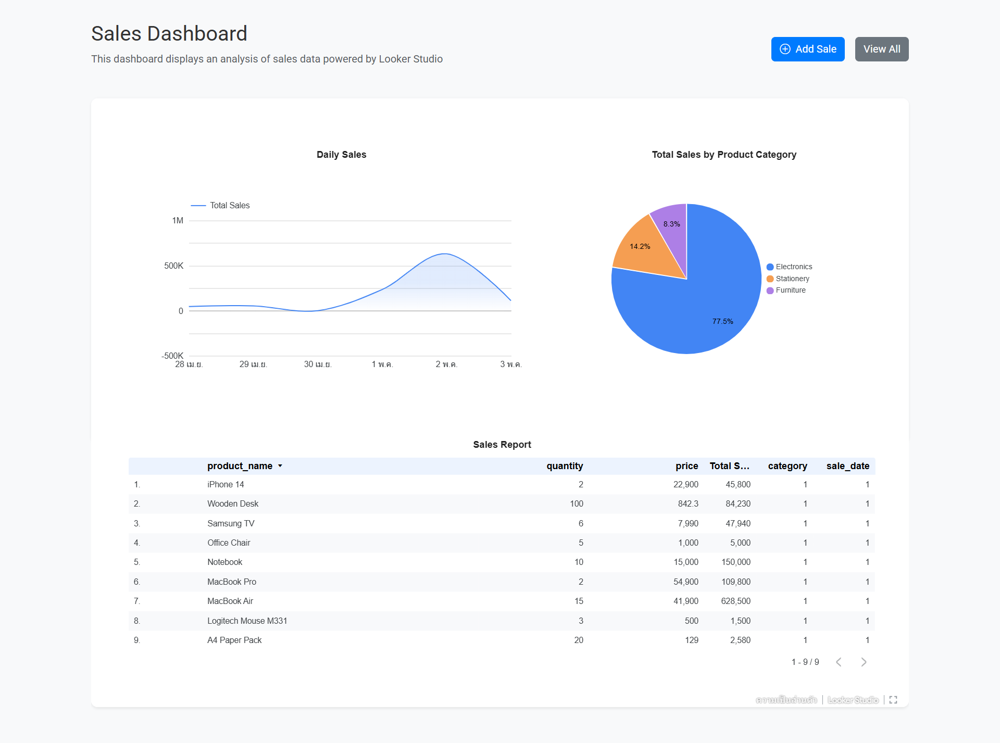
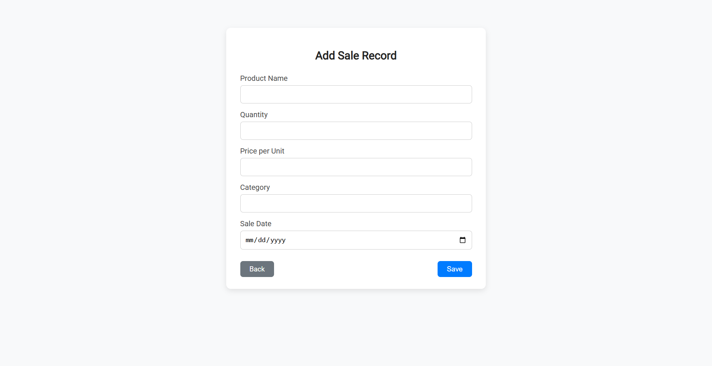
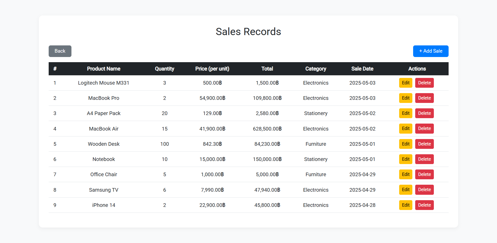

# 📊 Sales Dashboard System

**Sales Dashboard System** คือระบบจัดการข้อมูลการขาย ที่ออกแบบมาสำหรับบันทึก ดู และวิเคราะห์ยอดขาย
รองรับการเชื่อมต่อกับ **Looker Studio** เพื่อแสดงข้อมูลในรูปแบบ Interactive Dashboard
โดยนำเข้าข้อมูลจาก **phpMyAdmin** → **Google Sheets** ก่อน แล้วนำไปใช้ใน **Looker Studio** ผ่านการฝัง iframe

---

## ⚙️ Tech Stack

- **Frontend:** HTML5, CSS3 (Custom Styling), JavaScript
- **Styling Framework:** Bootstrap 5, Google Fonts (Roboto), Bootstrap Icons
- **Backend:** PHP (Procedural)
- **Database:** MySQL (via **phpMyAdmin**)
- **Data Visualization:** Looker Studio (Embed via iframe), Google Sheets (Data Import)

---

## 📸 Preview Screenshots

- **Dashboard (Looker Studio Embed)**  
  

- **Add Sale**  
  

- **View Sales**  
  

---

## 🙋‍♂️ ผู้พัฒนา

- GitHub: [@ctrlfaith](https://github.com/ctrlfaith)
